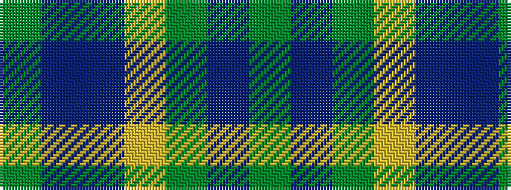

GBBYGBG

It is a 7 stripe tartan.

<figure class="pat-woven">

<figcaption>idealised sample</figcaption>
</figure>

## Colour Sequence



## Tartans with this colour sequence

| Tartans |
|---------------|
| [Heather MacRae](/variants/s7/dg2dr12db11lo6dy6dr12dg2~x2/)|
||
