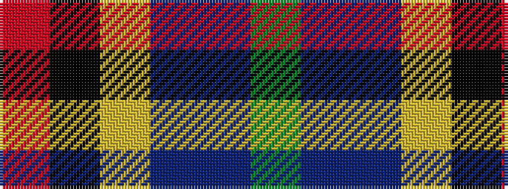

GBBYKR

It is a 6 stripe tartan.

<figure class="pat-woven">

<figcaption>idealised sample</figcaption>
</figure>

## Colour Sequence



## Tartans with this colour sequence

| Tartans |
|---------------|
| [Rei Okamoto (Personal)](/setts/s6/r60k40ly3p5p3dg12~x2/)|
||
