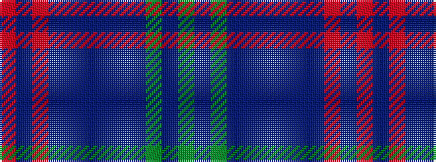

GBGBBBBBBRBR

It is a 12 stripe tartan.

<figure class="pat-woven">

<figcaption>idealised sample</figcaption>
</figure>

## Colour Sequence



## Tartans with this colour sequence

| Tartans |
|---------------|
| [Clydebank (Fashion)](/setts/s12/r2p3r1p16n2p9n9p3n15g1n3g2~x2/)|
||
