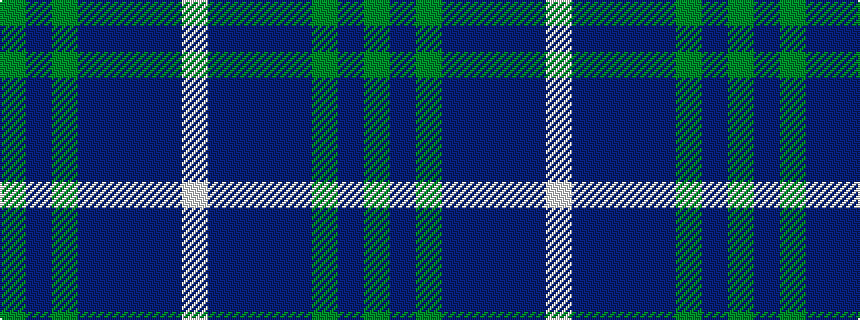

GBGBBBBW

It is a 8 stripe tartan.

<figure class="pat-woven">

<figcaption>idealised sample</figcaption>
</figure>

## Colour Sequence



## Tartans with this colour sequence

| Tartans |
|---------------|
| [Highlands School, (North Carolina)](/variants/s8/y12db2y2db30dbi3db2dbi13w4~x2/)|
||
