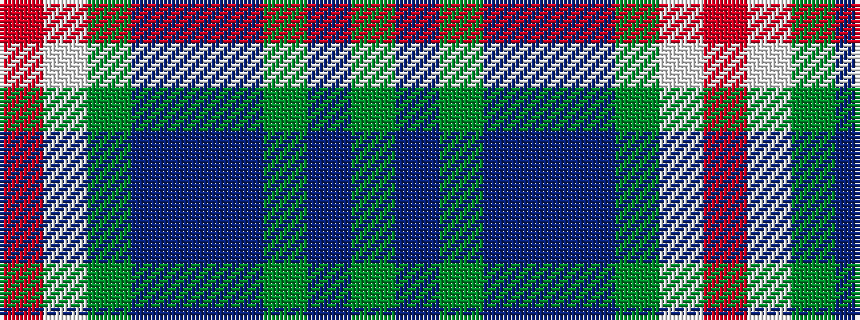

GBGBBBGWR

It is a 9 stripe tartan.

<figure class="pat-woven">

<figcaption>idealised sample</figcaption>
</figure>

## Colour Sequence



## Tartans with this colour sequence

| Tartans |
|---------------|
| [Spirit of Hoxa (District)](/variants/s9/dg2dp19dg2dp46t2dp10dg3lp2r2~x2/)|
||
