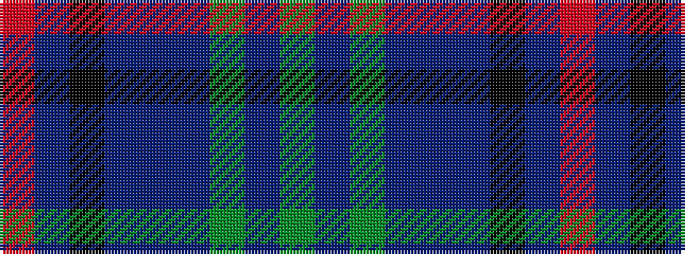

GBGBBBKBR

It is a 9 stripe tartan.

<figure class="pat-woven">

<figcaption>idealised sample</figcaption>
</figure>

## Colour Sequence



## Tartans with this colour sequence

| Tartans |
|---------------|
| [Stewmann (Personal)](/variants/s9/dg24t4dg3db11dp8db37k3db2r4~x2/)|
||
