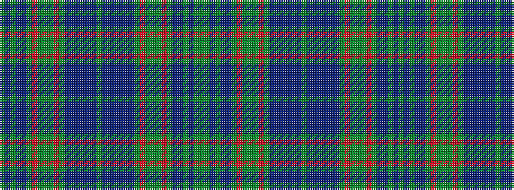

GBGBBGRGGGRGBBBBBBGBBBBBBGRGGGRGBBGBGG

It is a 38 stripe tartan.

<figure class="pat-woven">

<figcaption>idealised sample</figcaption>
</figure>

## Colour Sequence



## Tartans with this colour sequence

| Tartans |
|---------------|
| [Watkins of Wales](/variants/s38/g2gi2db5gi4db10b15gi10r12gi6g4gi6r12gi10b18b2t2db2b18db1g2/)|
||
