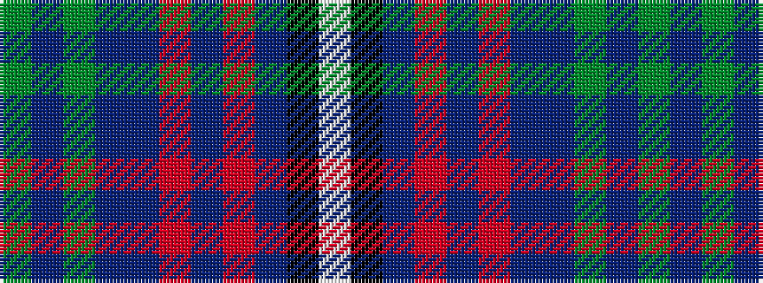

GBGBBRBRBKW

It is a 11 stripe tartan.

<figure class="pat-woven">

<figcaption>idealised sample</figcaption>
</figure>

## Colour Sequence



## Tartans with this colour sequence

| Tartans |
|---------------|
| [Liddell (Newfane, New York)](/variants/s11/y2db3y2db22b8r1b3r1b22k1w2~x2/)|
||
