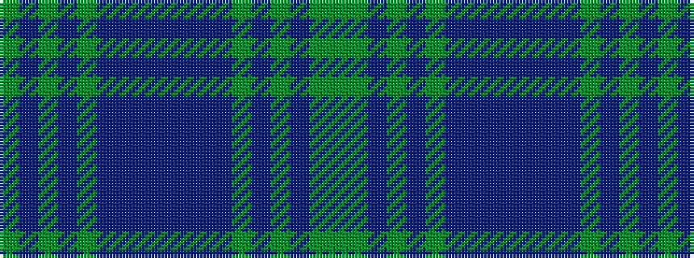

GBGBGBBBBBBBGBGBGG

It is a 18 stripe tartan.

<figure class="pat-woven">

<figcaption>idealised sample</figcaption>
</figure>

## Colour Sequence



## Tartans with this colour sequence

| Tartans |
|---------------|
| [Jones of Wales](/variants/s18/dg46db17dg5db7dg7t15db3t3db6t3db3t15dg7db7dg5db17dg46dgi4/)|
||
