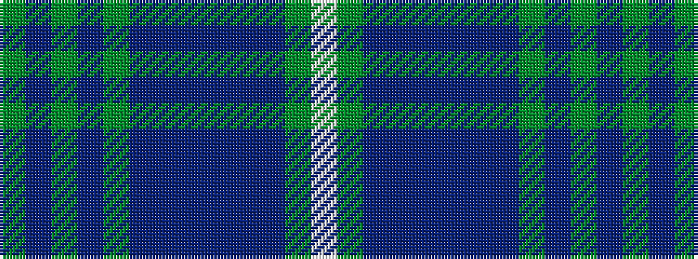

GBGBGBBBBBBGW

It is a 13 stripe tartan.

<figure class="pat-woven">

<figcaption>idealised sample</figcaption>
</figure>

## Colour Sequence



## Tartans with this colour sequence

| Tartans |
|---------------|
| [Scottish Tourist Guides Association](/variants/s13/g12dp3yi3dp3yi3dp12db3dp3db2dp2db14y1w3~x2/)|
||
