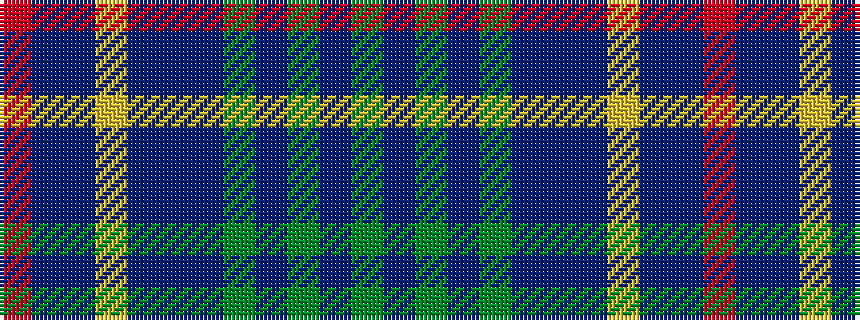

GBGBGBBBYBBR

It is a 12 stripe tartan.

<figure class="pat-woven">

<figcaption>idealised sample</figcaption>
</figure>

## Colour Sequence



## Tartans with this colour sequence

| Tartans |
|---------------|
| [Powys Welsh District Tartan](/variants/s12/dg24b7dg7b7dg7db22b7db4ly4db4b40r14/)|
||
