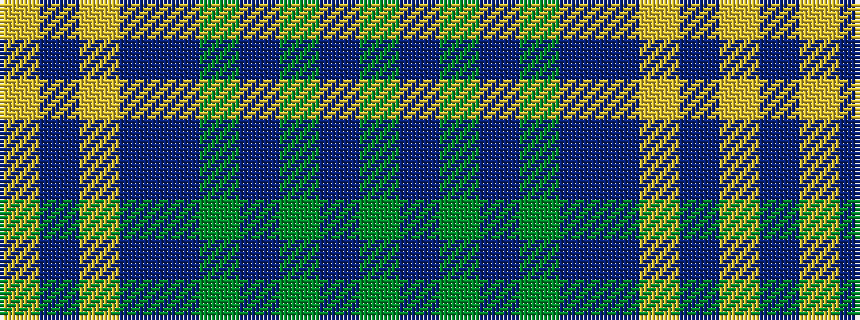

GBGBGBBYBY

It is a 10 stripe tartan.

<figure class="pat-woven">

<figcaption>idealised sample</figcaption>
</figure>

## Colour Sequence



## Tartans with this colour sequence

| Tartans |
|---------------|
| [Caisteal Leòdhais](/setts/s10/yi4t3yi18dt14y2dt2dp18lo1dp2lo3~x2/)|
||
