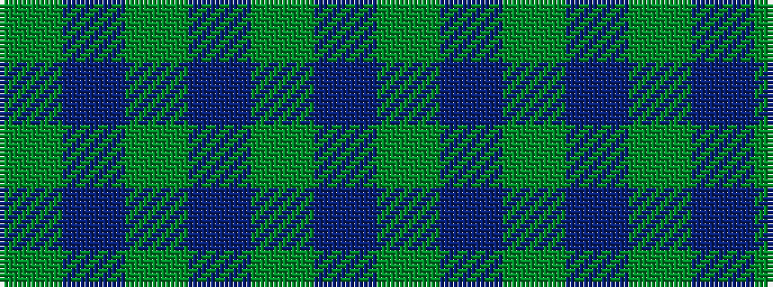

GBGBGBG

It is a 7 stripe tartan.

<figure class="pat-woven">

<figcaption>idealised sample</figcaption>
</figure>

## Colour Sequence



## Tartans with this colour sequence

| Tartans |
|---------------|
| [Blackwood (Corporate)](/variants/s7/dg5db1dg5dp1g5dbi1dg5~x2/)|
||
| [Blackwood (Loch Wood)](/variants/s7/gi5db1g5dp1gi5b1gi5~x4/)|
||
