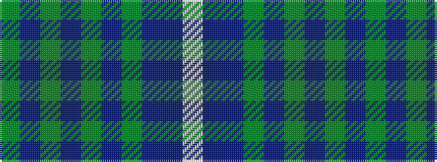

GBGBGBGBBW

It is a 10 stripe tartan.

<figure class="pat-woven">

<figcaption>idealised sample</figcaption>
</figure>

## Colour Sequence



## Tartans with this colour sequence

| Tartans |
|---------------|
| [South Carolina](/variants/s10/y8db1y1db24y2db1y2db5b20w5~x2/)|
||
