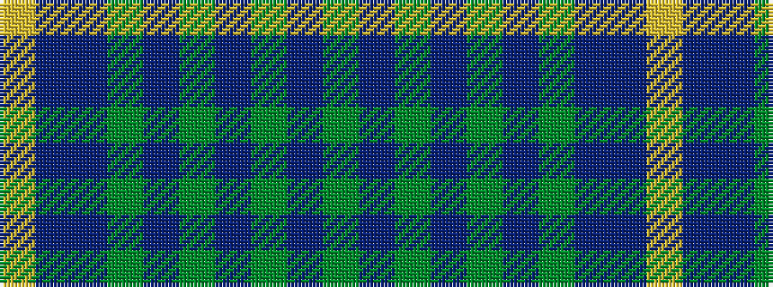

GBGBGBGBBY

It is a 10 stripe tartan.

<figure class="pat-woven">

<figcaption>idealised sample</figcaption>
</figure>

## Colour Sequence



## Tartans with this colour sequence

| Tartans |
|---------------|
| [Hanna of Leith (yellow line)](/variants/s10/dy9n4dy2n4dy2n30dy9n4t14lo2~x2/)|
||
