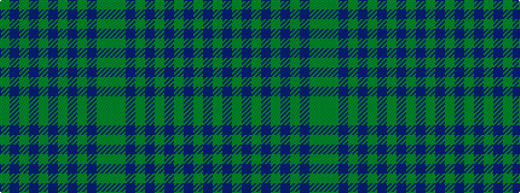

GBGBGBGBGBGG

It is a 12 stripe tartan.

<figure class="pat-woven">

<figcaption>idealised sample</figcaption>
</figure>

## Colour Sequence



## Tartans with this colour sequence

| Tartans |
|---------------|
| [Montgomerie](/setts/s12/dg27g39db3g3db4g3db3g39db3g3db4g3~x2/)|
||
| [Montgomerie/Montgomery](/setts/s12/dg27dgi39db3dgi3db4dgi3db3dgi39db3dgi3db4dgi3~x2/)|
||
