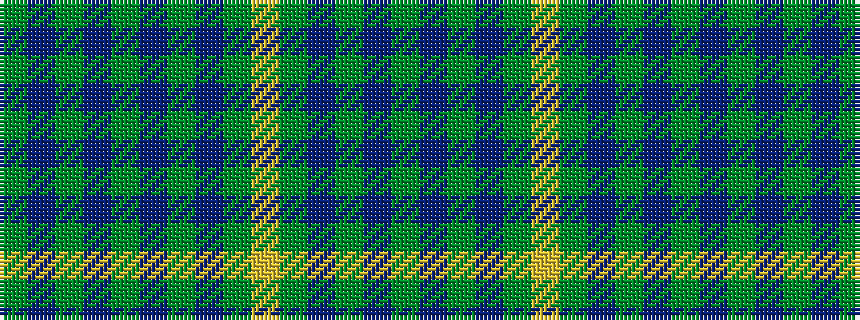

GBGBGBGBGYGBGBG

It is a 15 stripe tartan.

<figure class="pat-woven">

<figcaption>idealised sample</figcaption>
</figure>

## Colour Sequence



## Tartans with this colour sequence

| Tartans |
|---------------|
| [Aberlour Bicentenary](/setts/s15/y16dp6y6dt46y5dt8y5dp10y6lo8y48dp6y6dp6y16/)|
||
| [Aberlour Bicentenary (Commemorative)](/setts/s15/y16dp6y6db46y5db8y5dp10y6lo8y48dp6y6dp6y16/)|
||
