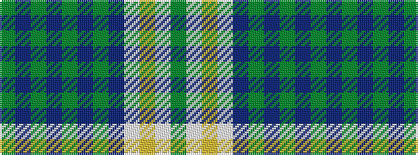

GBGBGBGBWYWG

It is a 12 stripe tartan.

<figure class="pat-woven">

<figcaption>idealised sample</figcaption>
</figure>

## Colour Sequence



## Tartans with this colour sequence

| Tartans |
|---------------|
| [McGrane (2014)](/setts/s12/g13do7g13do2g13do2g13do2w3lo4w3g4~x2/)|
||
