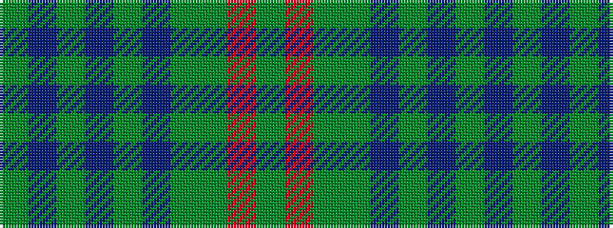

GBGBGBGGRG

It is a 10 stripe tartan.

<figure class="pat-woven">

<figcaption>idealised sample</figcaption>
</figure>

## Colour Sequence



## Tartans with this colour sequence

| Tartans |
|---------------|
| [Roddy's Highland Spirit (Fashion)](/setts/s10/y30n3y3n3y3n10g10yi20m2g5~x2/)|
||
