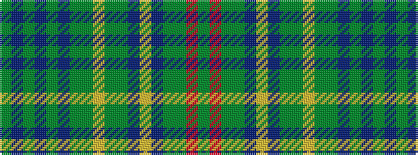

GBGBGBGGYGGBYBGGRG

It is a 18 stripe tartan.

<figure class="pat-woven">

<figcaption>idealised sample</figcaption>
</figure>

## Colour Sequence



## Tartans with this colour sequence

| Tartans |
|---------------|
| [Turcan Connell](/variants/s18/dy27dt3dy8dt4dy8dt3dy14g8lr5dy5g14dt12lr6dt12dy15g9r4g9~x2/)|
||
