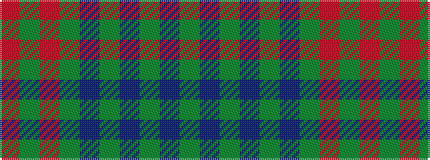

GBGBGBGRGR

It is a 10 stripe tartan.

<figure class="pat-woven">

<figcaption>idealised sample</figcaption>
</figure>

## Colour Sequence



## Tartans with this colour sequence

| Tartans |
|---------------|
| [Braveheart Htg (Fashion)](/variants/s10/g3db2g40db1g2db1g9r4g3r2~x4/)|
||
