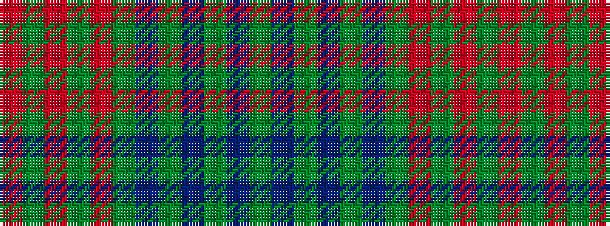

GBGBGBGRGRGR

It is a 12 stripe tartan.

<figure class="pat-woven">

<figcaption>idealised sample</figcaption>
</figure>

## Colour Sequence



## Tartans with this colour sequence

| Tartans |
|---------------|
| [Dublin](/setts/s12/r3g8r2g18m5g3dr3g3dr16g3dr3g3~x2/)|
||
