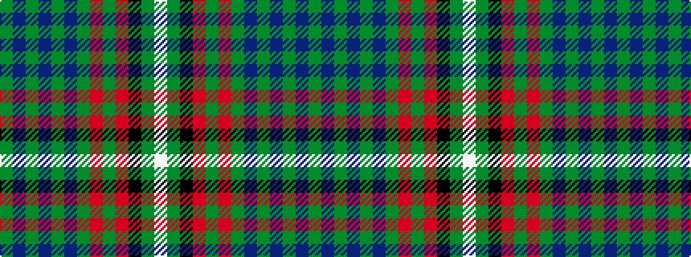

GBGBGBGRGRKGW

It is a 13 stripe tartan.

<figure class="pat-woven">

<figcaption>idealised sample</figcaption>
</figure>

## Colour Sequence



## Tartans with this colour sequence

| Tartans |
|---------------|
| [Boyle, Cameron (Personal)](/variants/s13/g5db20g20db2g2db2g25r2g2r17k8g2w2~x2/)|
||
| [Cameron Boyle, The (Personal)](/variants/s13/g5b20g2b2g2b2g25r2g2r17k8g2w2~x2/)|
||
