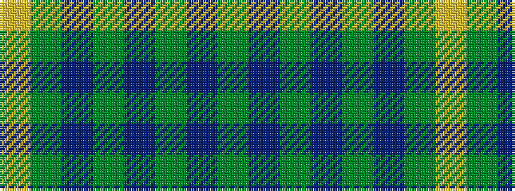

GBGBGBGY

It is a 8 stripe tartan.

<figure class="pat-woven">

<figcaption>idealised sample</figcaption>
</figure>

## Colour Sequence



## Tartans with this colour sequence

| Tartans |
|---------------|
| [Crow (Name)](/variants/s8/g2db2g6db4g3db4g18ly2~x4/)|
||
| [Scottish Pup](/variants/s8/dg8do2dg13db4dg12n22dg5ly3~x2/)|
||
