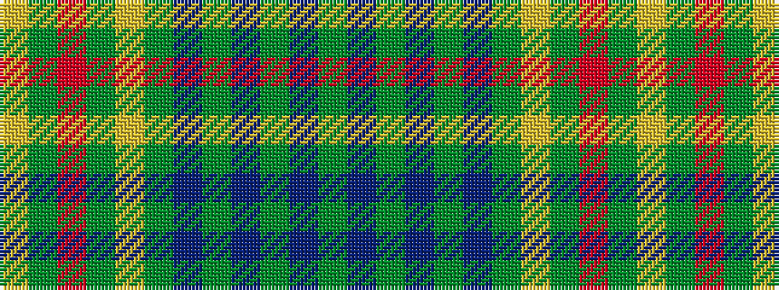

GBGBGBGYGRGY

It is a 12 stripe tartan.

<figure class="pat-woven">

<figcaption>idealised sample</figcaption>
</figure>

## Colour Sequence



## Tartans with this colour sequence

| Tartans |
|---------------|
| [Greenways Marketing Intl](/variants/s12/g3db3g3db24g3db3g3lo2g18r2g18lo2~x2/)|
||
