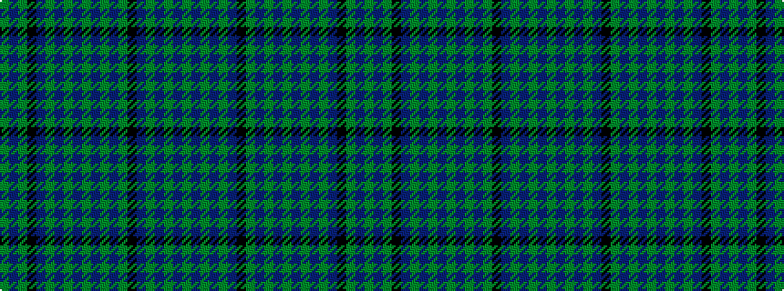

GBGBGBKGBGBGBGBGBKGBG

It is a 21 stripe tartan.

<figure class="pat-woven">

<figcaption>idealised sample</figcaption>
</figure>

## Colour Sequence



## Tartans with this colour sequence

| Tartans |
|---------------|
| [Matheson Htg (Clan)](/variants/s21/g8b4g1b1g1b24k8g4b1g1b1g4b8g1b1g1b1k8g8b2g2~x4/)|
||
| [Matheson Hunting](/variants/s21/g8b4g1b1g1b24k8g4b1g1b1g4b8g1b1g1b1k8g8b2g4~x2/)|
||
| [Matheson Hunting (Blue)](/variants/s21/y8db4y1db1y1db24k8y4db1y1db1y4db8y1db1y1db1k8y8db2y2~x4/)|
||
| [Matheson, hunting](/variants/s21/g8db4g1db1g1db24k8g4db1g1db1g4db8g1db1g1db1k8g8db2g4~x2/)|
||
