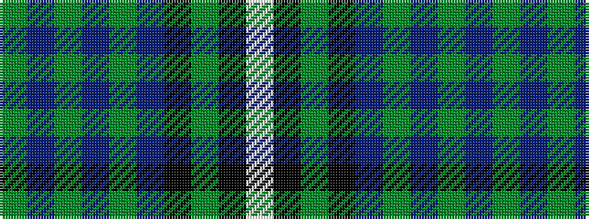

GBGBGBKGKW

It is a 10 stripe tartan.

<figure class="pat-woven">

<figcaption>idealised sample</figcaption>
</figure>

## Colour Sequence



## Tartans with this colour sequence

| Tartans |
|---------------|
| [Rennie](/setts/s10/w6k1g29k23p27g3p3g3p3g4~x2/)|
||
| [Rennie (Personal)](/setts/s10/w6k1y28k24dp25y3dp3y3dp3y4~x2/)|
||
| [Rennie Family Tartan Tartan Number: 716. Earliest known date: 1981. For Robin Rennie. The accreditation list gives the author and weaver, James Scarlett, as the designer in 1980. The tartan register records the designer as Peter MacDonald who worked as a weaver for the Scottish Tartans Society in 1981. Rennies, Rainys and Rainnies (from 'Ranald') are listed as a sept of MacDonell of Keppoch. See products available Copyright © Blair Urquhart, Comrie, 2015](/setts/s10/w6k1g29k23dp27g3dp3g3dp3g4~x2/)|
||
