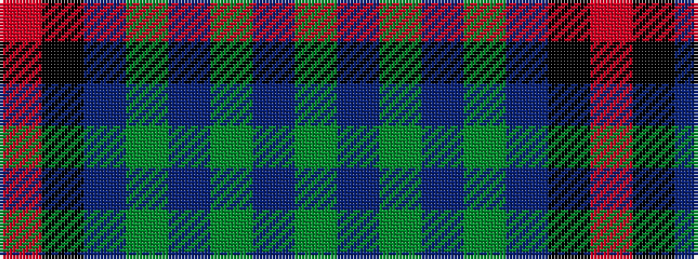

GBGBGBKR

It is a 8 stripe tartan.

<figure class="pat-woven">

<figcaption>idealised sample</figcaption>
</figure>

## Colour Sequence



## Tartans with this colour sequence

| Tartans |
|---------------|
| [Frederiction Police Force](/setts/s8/r6k55db8g6db10g6db6g4~x2/)|
||
