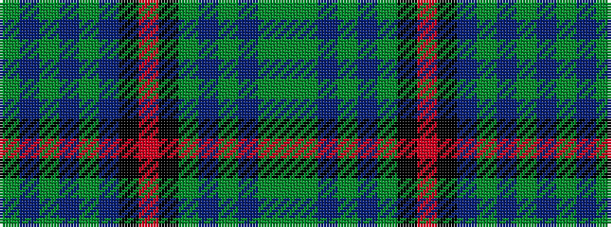

GBGBGBKRKGBGBGG

It is a 15 stripe tartan.

<figure class="pat-woven">

<figcaption>idealised sample</figcaption>
</figure>

## Colour Sequence



## Tartans with this colour sequence

| Tartans |
|---------------|
| [Ontario, Ensign of](/variants/s15/y4dg18do3dg3do3dg18k2r4k2do16dg3do3dg3do16dg3~x2/)|
||
| [Ontario, Ensign of (District)](/variants/s15/dg3do16dg3do3dg3do16k2r4k2dg18do3dg3do3dg16y3~x2/)|
||
