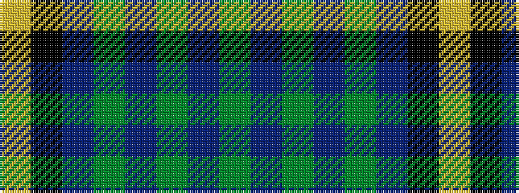

GBGBGBKY

It is a 8 stripe tartan.

<figure class="pat-woven">

<figcaption>idealised sample</figcaption>
</figure>

## Colour Sequence



## Tartans with this colour sequence

| Tartans |
|---------------|
| [Carrick Hunting (Personal)](/setts/s8/g13dp1g1dp1g3b5k4ly2~x4/)|
||
| [Carrick Hunting District Tartan Tartan Number: 721. Earliest known date: 1930 This sample comes from the MacGregor-Hastie collection which forms the basis of the cloth archive of the Scottish Tartans Society. Some of the samples, including this one, were unmarked. One can assume that the sample dates between 1930 and 1950. See products available Copyright © Blair Urquhart, Comrie, 2015](/setts/s8/g13dp1g1dp1g3db5k4ly2~x2/)|
||
| [Carrick, hunting](/setts/s8/g13p1g1p1g3db5k4ly2~x2/)|
||
