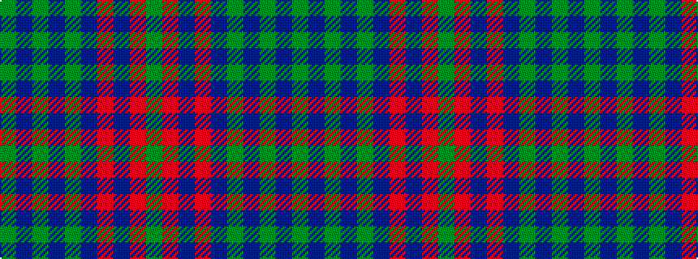

GBGBGBRBRG

It is a 10 stripe tartan.

<figure class="pat-woven">

<figcaption>idealised sample</figcaption>
</figure>

## Colour Sequence



## Tartans with this colour sequence

| Tartans |
|---------------|
| [McGlynn](/variants/s10/g18db3g3db3g2db8m23db2m4g2~x2/)|
||
