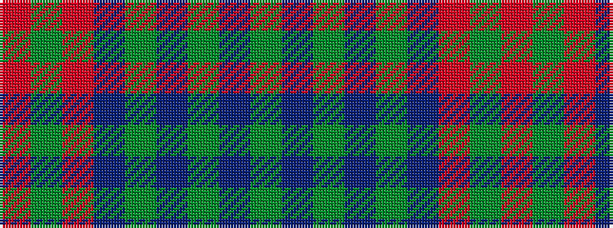

GBGBGBRGR

It is a 9 stripe tartan.

<figure class="pat-woven">

<figcaption>idealised sample</figcaption>
</figure>

## Colour Sequence



## Tartans with this colour sequence

| Tartans |
|---------------|
| [Lindsay](/setts/s9/dg24dt3dg3dt3dg3dt9m24dg3m4~x2/)|
||
| [Lindsay (Chisholm Red)](/setts/s9/dg24db3dg3db3dg3db9m24dg3m4~x2/)|
||
