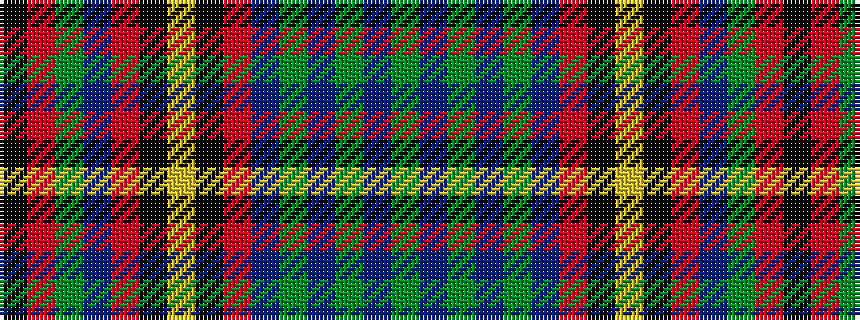

GBGBGBRKYKRBGRK

It is a 15 stripe tartan.

<figure class="pat-woven">

<figcaption>idealised sample</figcaption>
</figure>

## Colour Sequence



## Tartans with this colour sequence

| Tartans |
|---------------|
| [Loseby, Luke (Personal)](/setts/s15/y15dt3y3dt3y3dt16o16k5lo2k5o16dt16y15r1k4~x2/)|
||
| [Loseby, Luke (Personal)](/setts/s15/dg15db3dg3db3dg3db16o16k5lo2k5o16db16dg15r1k4~x2/)|
||
