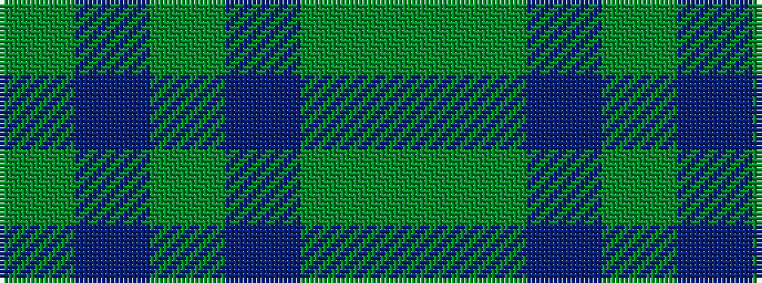

GBGBGG

It is a 6 stripe tartan.

<figure class="pat-woven">

<figcaption>idealised sample</figcaption>
</figure>

## Colour Sequence



## Tartans with this colour sequence

| Tartans |
|---------------|
| [Keeper of the Quaich](/variants/s6/dy3db3dy3db27dy40y3/)|
||
