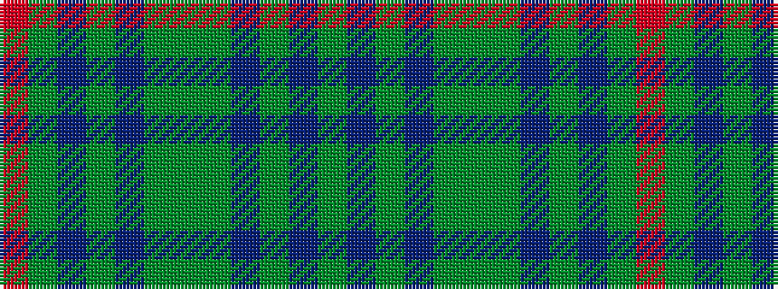

GBGBGGGBGBGR

It is a 12 stripe tartan.

<figure class="pat-woven">

<figcaption>idealised sample</figcaption>
</figure>

## Colour Sequence



## Tartans with this colour sequence

| Tartans |
|---------------|
| [Highlander](/setts/s12/g33b4g4b4g5g13dg13dp13dg2b11dg1o2~x2/)|
||
