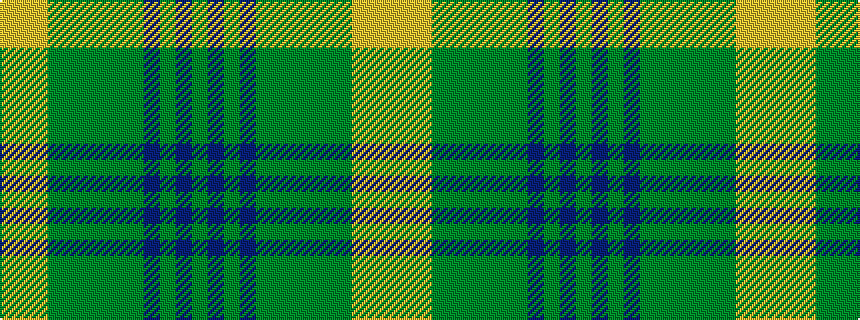

GBGBGGGGGGYYY

It is a 13 stripe tartan.

<figure class="pat-woven">

<figcaption>idealised sample</figcaption>
</figure>

## Colour Sequence



## Tartans with this colour sequence

| Tartans |
|---------------|
| [Balmoral Hotel Edinburgh](/setts/s13/y5dp1y1dp1y1dg3y3dg1y3dg3ly3lyi1ly1~x4/)|
||
