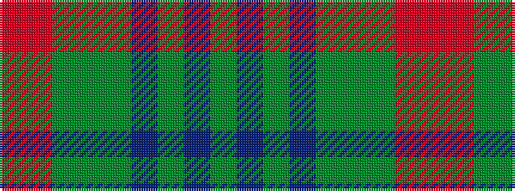

GBGBGGGRR

It is a 9 stripe tartan.

<figure class="pat-woven">

<figcaption>idealised sample</figcaption>
</figure>

## Colour Sequence



## Tartans with this colour sequence

| Tartans |
|---------------|
| [Lawrence's Seven Pillars of Khaki](/setts/s9/r3o23y8g6y8t6y10t12y3~x2/)|
||
| [Lawrence's Seven Pillars of Khaki](/setts/s9/r3o23gi8g6gi8t6gi10t12gi3~x2/)|
||
