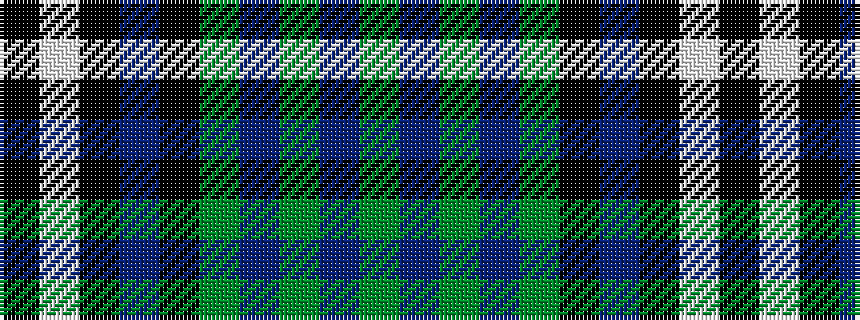

GBGBGKBKWK

It is a 10 stripe tartan.

<figure class="pat-woven">

<figcaption>idealised sample</figcaption>
</figure>

## Colour Sequence



## Tartans with this colour sequence

| Tartans |
|---------------|
| [Scotland the Brave](/setts/s10/ki6w1ki40p1k12dg12p6dg2dp2dg4~x2/)|
||
