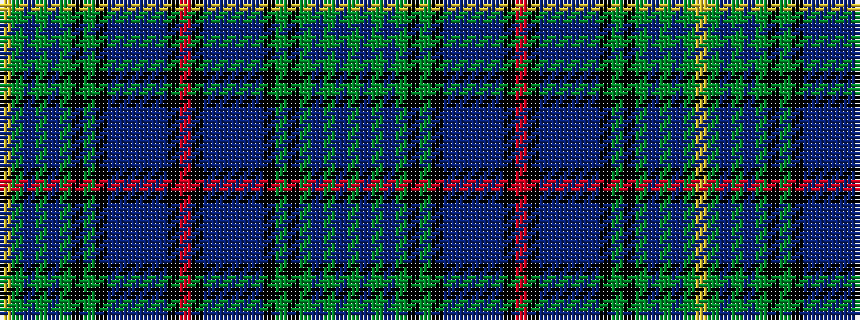

GBGBGKGKBBBBBKRKBBBBBKGKGBGBGY

It is a 30 stripe tartan.

<figure class="pat-woven">

<figcaption>idealised sample</figcaption>
</figure>

## Colour Sequence



## Tartans with this colour sequence

| Tartans |
|---------------|
| [MacWatts (Personal)](/setts/s30/g7dp2g2dp12g2k2g1k12db2db12db2db2db7k2r3k2db7db2db2db12db2k12g1k2g2dp12g2dp2g7ly4~x2/)|
||
