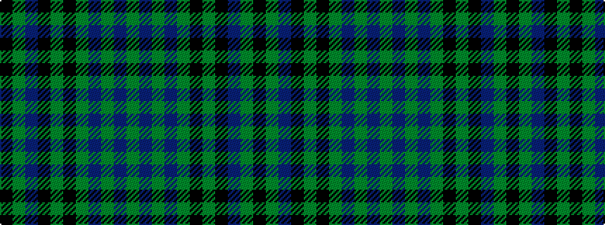

GBGBGKGKBGK

It is a 11 stripe tartan.

<figure class="pat-woven">

<figcaption>idealised sample</figcaption>
</figure>

## Colour Sequence



## Tartans with this colour sequence

| Tartans |
|---------------|
| [Clergy (Clark)](/variants/s11/k2dg2db10k10dg2k10dg2db3dg2db5dg2~x2/)|
||
| [Clergy (Clark) (Clan)](/variants/s11/k2g2db10k10g2k10g2db3g2db5g2~x2/)|
||
