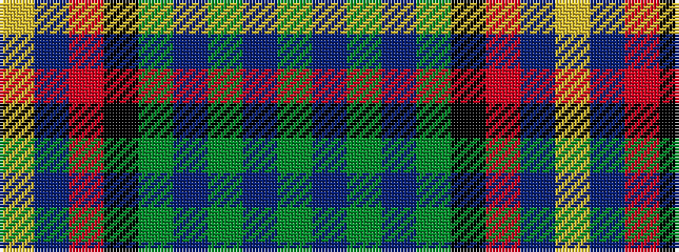

GBGBGKRBY

It is a 9 stripe tartan.

<figure class="pat-woven">

<figcaption>idealised sample</figcaption>
</figure>

## Colour Sequence



## Tartans with this colour sequence

| Tartans |
|---------------|
| [(1) Stewart, modern](/variants/s9/g44db2g4db2g6k16m40db2ly11/)|
||
