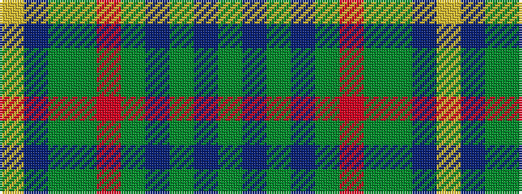

GBGBGRGGBY

It is a 10 stripe tartan.

<figure class="pat-woven">

<figcaption>idealised sample</figcaption>
</figure>

## Colour Sequence



## Tartans with this colour sequence

| Tartans |
|---------------|
| [Leitrim](/setts/s10/y3dr18y4dr3y4r13y3y18dr2lo3~x2/)|
||
