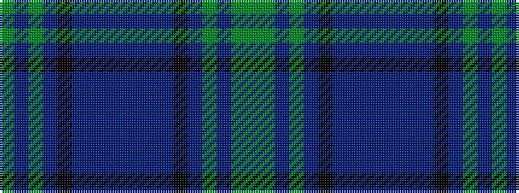

GBGBKBBBBBBBKBGBGG

It is a 18 stripe tartan.

<figure class="pat-woven">

<figcaption>idealised sample</figcaption>
</figure>

## Colour Sequence



## Tartans with this colour sequence

| Tartans |
|---------------|
| [Jones Hunting](/setts/s18/g24dp4g3dp8k3t8dp2t2dp4t2dp2t8k3dp8g3dp4g24g2~x2/)|
||
