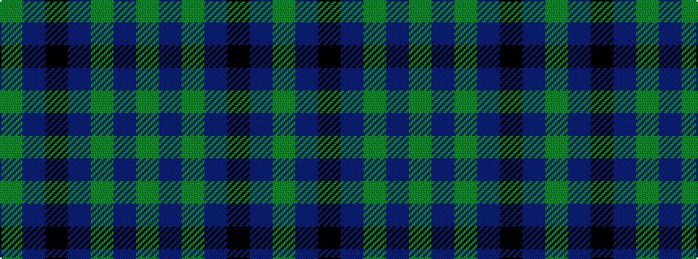

GBGBKBG

It is a 7 stripe tartan.

<figure class="pat-woven">

<figcaption>idealised sample</figcaption>
</figure>

## Colour Sequence



## Tartans with this colour sequence

| Tartans |
|---------------|
| [Tern House](/variants/s7/dg23db3k8db4dg4db56dy8/)|
||
