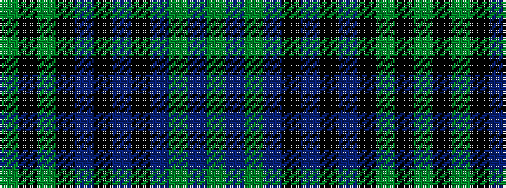

GBGBKBKBKGKG

It is a 12 stripe tartan.

<figure class="pat-woven">

<figcaption>idealised sample</figcaption>
</figure>

## Colour Sequence



## Tartans with this colour sequence

| Tartans |
|---------------|
| [Lysaght Hunting](/setts/s12/dy6db4dy6db11k1db3k3db1k11dg6k4dg6~x4/)|
||
