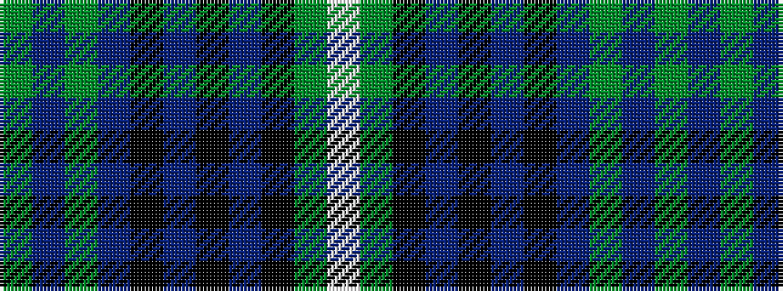

GBGBKBKBKGW

It is a 11 stripe tartan.

<figure class="pat-woven">

<figcaption>idealised sample</figcaption>
</figure>

## Colour Sequence



## Tartans with this colour sequence

| Tartans |
|---------------|
| [Selby](/setts/s11/g3db1g1db12k2db2k2db3k12gi24w3~x2/)|
||
| [Selby (Name)](/setts/s11/g3n1g1n12k2n2k2n3k12gi24w3~x2/)|
||
