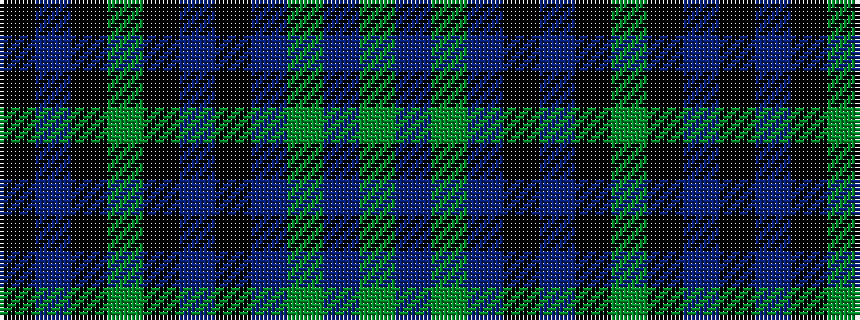

GBGBKBKGKBK

It is a 11 stripe tartan.

<figure class="pat-woven">

<figcaption>idealised sample</figcaption>
</figure>

## Colour Sequence



## Tartans with this colour sequence

| Tartans |
|---------------|
| [Fort William](/setts/s11/g17t2g2t2k21t2k3g30k2t2k4~x2/)|
||
| [Fort William (District?)](/setts/s11/g17t2y2t2k21t2k3g30k2t2k4~x2/)|
||
