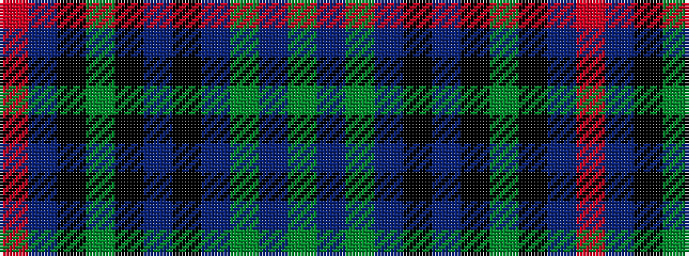

GBGBKBKGKBR

It is a 11 stripe tartan.

<figure class="pat-woven">

<figcaption>idealised sample</figcaption>
</figure>

## Colour Sequence



## Tartans with this colour sequence

| Tartans |
|---------------|
| [Brethwe Powys](/variants/s11/dg24db7dg7db7k22db7k4dy4k4db40m14/)|
||
