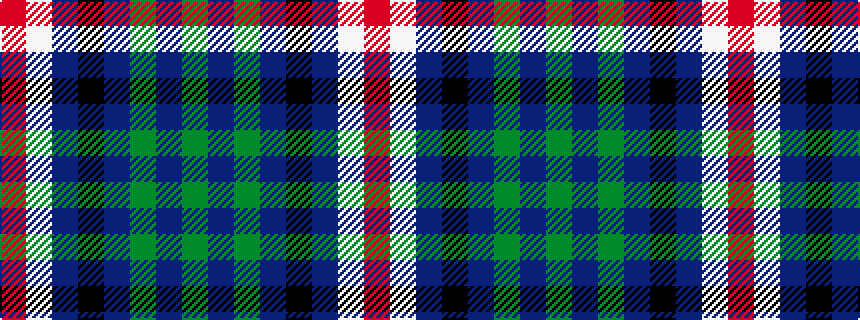

GBGBKBWR

It is a 8 stripe tartan.

<figure class="pat-woven">

<figcaption>idealised sample</figcaption>
</figure>

## Colour Sequence



## Tartans with this colour sequence

| Tartans |
|---------------|
| [S.O.B.H.D. (Corporate)](/variants/s8/r3w30db10k3dp15g2dp3g1~x2/)|
||
