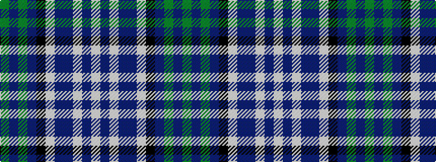

GBGBKWBBWBW

It is a 11 stripe tartan.

<figure class="pat-woven">

<figcaption>idealised sample</figcaption>
</figure>

## Colour Sequence



## Tartans with this colour sequence

| Tartans |
|---------------|
| [Scottish Motor Trade Assoc. (Corp)](/setts/s11/g5t2g16t10k2w3db6t14w2db4w2~x2/)|
||
| [Scottish Motor Trade Association](/setts/s11/g12dbi4gi54db26k4w8dbi18db44w3dbi12w4/)|
||
